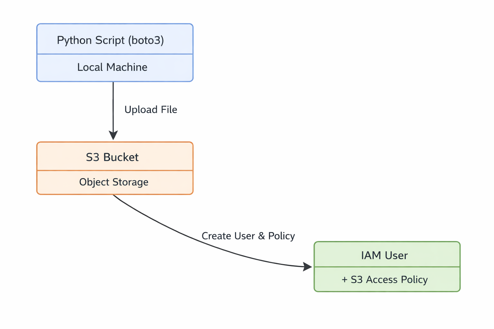

# S3 + IAM Automation

This project automates AWS S3 storage and IAM access control using Python and boto3.

The goal was to create a simple, repeatable way to provision a storage bucket, upload files, and grant limited access through IAM policies.

## What It Does

The script automates:

- S3 bucket creation
- File upload to S3
- Listing objects in the bucket
- IAM user creation
- IAM policy creation
- Attaching the policy to the user

The project is idempotent, so running it multiple times reuses existing resources instead of creating duplicates.

## Architecture



```text
config.yaml
    ↓
main.py
    ↓
utils.py
    ↓
AWS (S3 + IAM)
```

## Design Decisions

- Used boto3 to get direct experience working with the AWS SDK and programmatically creating resources
- Used S3 because it is one of the most common AWS services and a good foundation for learning cloud storage
- Scoped the IAM policy to a single S3 bucket instead of granting full S3 access to follow least-privilege principles
- Added idempotent logic so the script can be safely rerun without creating duplicate buckets or IAM users

## Tradeoffs

- boto3 gives more control than Terraform, but it requires more code and error handling
- Restricting the IAM policy to one bucket improves security, but it makes the policy less flexible
- Idempotent logic makes repeated runs safer, but it adds additional checks and complexity

## Features

- Automated S3 bucket provisioning
- File upload and object listing
- IAM user creation
- Scoped S3 access policy
- Idempotent resource handling

## Tech Stack

- Python
- boto3
- PyYAML
- AWS S3
- AWS IAM

## Running the Project

```bash
aws configure
pip install -r requirements.txt
python main.py
```

## Example Output

```text
Bucket created: my-demo-bucket
IAM user created: s3-demo-user
Policy attached successfully
```

## What This Project Demonstrates

- AWS storage automation
- IAM least-privilege access control
- Programmatic AWS resource creation with boto3
- Idempotent infrastructure logic
- Secure S3 access management

## Future Improvements

- Add IAM role creation instead of only IAM users
- Add support for multiple buckets
- Encrypt uploaded files with SSE-S3 or KMS
- Generate temporary credentials instead of long-lived users
- Rebuild the same workflow with Terraform